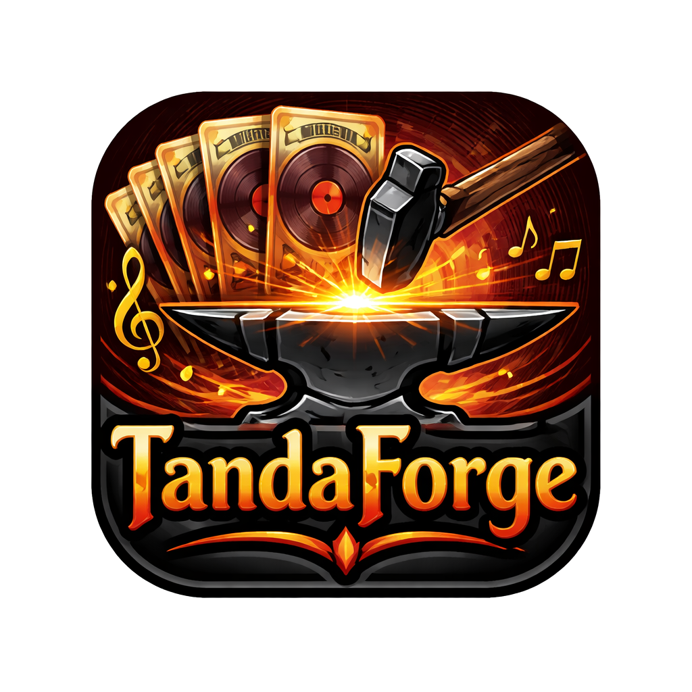
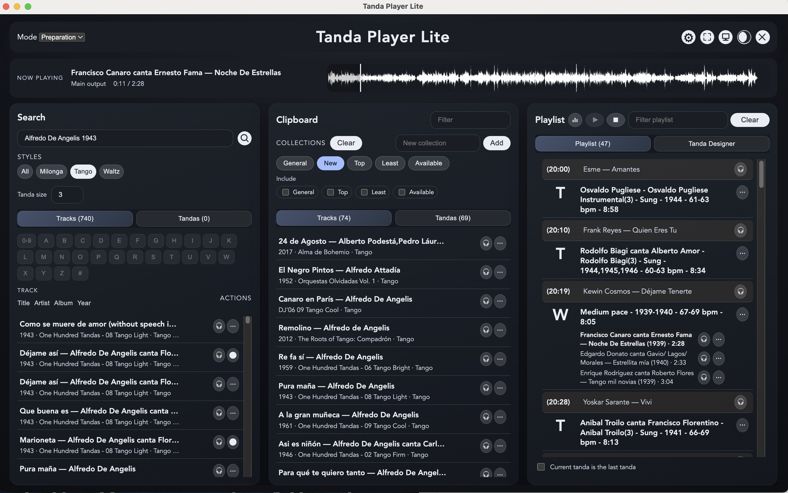
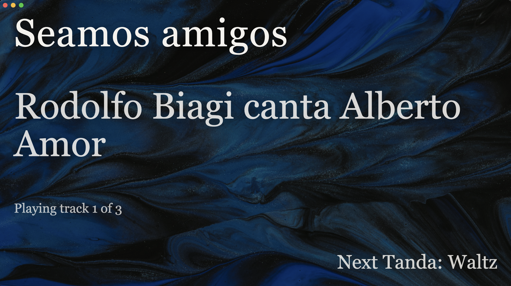

# Tanda Forge



Tanda Forge is a purpose-built DJ tool for Argentine Tango—designed around tandas, real workflows, and live decision-making.

Fast when you need it. Safe when it matters. Flexible when the floor changes.

## Background

Tanda Forge is a desktop app for Argentine Tango DJs who want a fast, safe, and flexible tanda preparation and live playback app.

It evolved from the original Raspberry Pi Tanda Player and focuses on practical live DJ workflows: building tandas, managing playlists, cueing audio, and adapting quickly during a milonga.

This project is a collaboration between David Goddard (design and requirements) and ChatGPT Codex (implementation, tests, and documentation).




---

## Free & Open Source

Tanda Forge is completely free and open source.

* No subscriptions, no lock-in
* Built by tango DJs, for tango DJs
* Open for contributions and community-driven improvement

---

## Download

Available for all major platforms:

* **macOS**
* **Windows**
* **Linux**

👉 [Pre-built binaries for Tanda Forge on GitHub](https://github.com/davidgoddard/tanda-forge/releases/)

## User Guide

See [User Guide](docs/user-guide.md)

---

## Built for Tango DJing

Most DJ software treats music as individual tracks. Tango doesn’t.

Tanda Forge is built around:

* Tandas as the core unit
* Flow across the whole night
* Real-time adaptation to the room

---

## Features

### 🎼 Build Tandas Quickly

Create, refine, and reuse tandas without friction.

* Build from tracks or existing tandas
* Edit and rebalance in seconds
* Keep musical consistency across your sets

---

### ⚡ Designed for Live DJing

No surprises when you're in front of a room.

* Instant playback and fast transitions
* Safe “Live Mode” to prevent mistakes
* Cue and prepare without interrupting flow

All movements of tandas and tracks is done through keyboard and menus, safer than drag/drop

---

### 🎧 Headphone Cueing & Dual Audio

Preview privately, play confidently.

* Separate headphone and main outputs
* Cue upcoming tracks before committing
* Stay in control during transitions

---

### 🎚 Consistent Sound, Automatically

Fix common audio issues before they reach the floor.

* Playback level normalization
* Automatic silence trimming
* Smooth, predictable transitions

---

### 🎶 Smart Cortina Control

Handle cortinas without breaking flow.

* Global or per-slot cortina settings
* Built-in fade behaviour
* Manual override when needed

---

### 🗂 Playlist & Set Building

Shape the night, not just the next tanda.

* Build full playlists from tandas
* Reorder and adapt during play
* Clear visual indicators of tanda style
* See **start times for every tanda** at a glance

---

### 📋 Clipboard & Collections Workflow

Work fast without committing too early.

* Use the clipboard to quickly gather candidate tracks or tandas
* Build and compare ideas in collections
* Integrated search for **similar tracks and tandas** to accelerate selection
* Move seamlessly from exploration → staging → playlist
* Ideal for real-time adaptation during a milonga

---

### 📊 Diversity Insights

Make better programming decisions across the whole night.

* View diversity reports for playlists and collections
* Understand balance across orchestras, singers, rhythms, and styles
* Avoid repetition and maintain musical variety

---

### 🎯 Style Guidance & Validation

Stay consistent with tango DJ best practices.

* Tanda sequence checks to catch mismatches
* Clear style indicators across the playlist
* Supports confident, coherent programming

---

### 🔍 Fast Search & Staging Workflow

Find, test, and assemble music quickly.

* Search tracks or existing tandas
* Stage ideas in clipboard collections
* Iterate before committing to the playlist

---

### 🧠 Multiple Working Modes

Optimised for each stage of DJing.

* **Preparation Mode** — fast auditioning and building
* **Live Mode** — safe, focused performance
* **Edit Mode** — efficient metadata updates

---

## How It Works

A typical workflow:

1. Search tracks or tandas
2. Stage options in clipboard or collections
3. Build tandas in the designer
4. Add to playlist
5. Cue and play live

Simple. Fast. Repeatable.

---

## Documentation

Full user guide:
https://github.com/davidgoddard/tanda-forge/blob/main/docs/user-guide.md

---

## Why DJs Use Tanda Forge

Because during a milonga:

* You don’t have time to fight your software
* You need to react to the floor
* You need confidence nothing will break

Tanda Forge is built for that reality.

---

## Status

Active development. Built for real-world use, evolving with feedback.

---

## Get Started

```bash
git clone https://github.com/davidgoddard/tanda-forge.git
cd tanda-forge
```

Or download a release build for your platform (see above).

---

## Contributing

Ideas, feedback, and pull requests are welcome.

