# **Tanda Forge** User Guide

This guide introduces the layout, explains initial setup, and walks through searching, collecting, and building tandas and playlists.

## Screen font size (zoom)

The app supports normal browser-style zoom controls so you can change the on-screen font size and layout density:

- **macOS**:
  - Increase size: `Command` + `+`
  - Decrease size: `Command` + `-`
  - Reset to default: `Command` + `0`
- **Windows / Linux**:
  - Increase size: `Ctrl` + `+`
  - Decrease size: `Ctrl` + `-`
  - Reset to default: `Ctrl` + `0`

## Key Areas and Roles

The app is organized into three main columns plus a settings area:

- **Search (left column)**: Find tracks and tandas, filter by styles, and send results to a clipboard, an open tanda or a playlist.
- **Clipboard (middle column)**: A staging area with collections. Store tracks/tandas temporarily, build sets, and move items into the playlist.
- **Playlist (right column)**: Your running order. Add tandas/tracks, see predicted start times, and control playback.
- **Settings (top-right gear)**: Configure audio outputs, library folders, language, styles, playlists, and diagnostics.


## Overview

The application is in effect a single page application where the DJ can build and play a playlist.  A playlist in this context is a pre-defined
sequence of tandas optionally separated by cortinas.


The buttons are:
- Congiguration/Setup
- Full screen toggle
- Open/close display window
- Open diversity viewer
- Toggle themes
- Close app.

The playlist is configured in the "config" page by clicking the "Settings" button in the top right and then clicking on the playlist tab.  The main things
to set are the size and style of each tanda in the sequence required - typically this seems to be some variation of 3 or 4 tracks per tanda in the sequence of 
some tangos, then a break such as a Waltz followed by more tangos and a milonga and then the sequence repeats.  This sequence is set using the sequence of numbers
and letters; 3t or 4T etc.  So a simple playlist might be "4T 4T 3W 4T 4T 3M".  When adding tandas to the playlist the application will check the target position's size
and style and warn if the user is about to drop a mis-matching tanda into it.

In the same Playlist settings tab there is now a **Playlist Files** section.  This is for saving or moving the current working playlist without touching the rest of the system data.

#### Playlist Save / Import

- **Save Playlist** opens a normal file-save dialog.
- The filename extension controls the format:
  - save as `.json` for the native Tanda Forge playlist format
  - save as `.m3u` or `.m3u8` for grouped M3U interchange
- **Import Playlist** opens a file picker and loads either format back into the current playlist.
- For safety, playlist import is only allowed while playlist playback is idle.

#### Native JSON Playlist Format

This is the recommended format when the destination machine is also running Tanda Forge.

What JSON preserves:

- playlist order
- individual track rows
- tanda rows as tanda snapshots
- tanda names
- tanda track membership
- mismatch markers
- selected cortina set name
- compatible saved cortina slot assignments

What JSON still depends on:

- the destination laptop having access to the same music files
- those files being matchable by full path or, preferably, by relative path inside the configured music roots

If a track cannot be matched locally during import, that item is skipped and the import result reports warnings.

#### Grouped M3U / M3U8 Playlist Format

This is the portability format.  It is useful when:

- you want to move a playlist to another laptop that has the same music folder layout
- you want a format that other playlist tools can still open
- you want a simpler text-based interchange file

How Tanda Forge writes grouped M3U:

- each tanda is written as a contiguous grouped block
- group information is written using `group-title` and `#EXTGRP`
- track entries are written using relative paths where possible
- plain standalone track rows are written as normal ungrouped entries

How Tanda Forge reads grouped M3U:

- contiguous entries with the same `group-title` or `#EXTGRP` are treated as one tanda
- ungrouped entries are imported as standalone track rows
- tanda boundaries behave like normal tanda gaps after import
- cortinas are not stored as explicit playlist items in M3U, so the receiving system uses its own normal cortina behavior for those tanda boundaries

What grouped M3U does **not** fully preserve:

- full tanda metadata beyond basic grouping
- playlist sequence rules
- expected tanda sizes from the configured sequence
- saved cortina slot choices
- richer Tanda Forge-specific state

So grouped M3U should be treated as a best-effort interchange format, not as the canonical archive format.

#### Cross-Laptop Use

If you are sending a playlist to another laptop, the most reliable arrangement is:

- both machines have the same relative folder structure inside the music roots
- for example both contain something like `Tango/Di Sarli/...` and `Vals/...`
- the absolute root path can differ between laptops

This is why relative paths are preferred for grouped M3U import/export.

Things that can still cause warnings or skipped items:

- files missing on the destination machine
- duplicate relative paths in different roots
- a playlist built from a library that is not organized the same way on the receiving machine

For a reliable backup and restore of a playlist between Tanda Forge systems, JSON remains the recommended format. Grouped M3U is useful when you want a more portable interchange file that other playlist tools can also open.

The playlist timing values affect how one item leads into the next:
- Positive value: silence/pause before the next track or cortina starts.
- Zero: immediate handover with no added silence.
- Negative value: overlap/crossfade.  The next item starts before the current one ends, and the absolute value of the number is used as the overlap duration.  For example `-2` means about a two-second mix.

Once cortinas have been assigned to playlist slots, those slot choices are
saved with the playlist and restored the next time the app opens, whether they
came from auto-planning or from a manual replacement. If you later change the
selected cortina set in Playlist settings, those saved slot assignments are
cleared and the playlist reassigns cortinas from the newly selected set. If you
extend the playlist with more tandas, only the new cortina rows are filled from
the current set; already assigned cortina rows stay as they were.

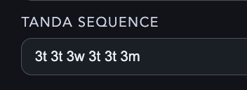

The sequence also supports grouped alternatives with independent sizes, for example:
`3T 3T 3W 3T 3T (2C 3M)`.
This means that slot can accept either a 2-track Candombe tanda or a 3-track Milonga tanda.
The sequence field validates both syntax and style letters, so any unknown letter code is flagged until it matches a configured style-family code.

The playlist can be pre-built prior to the event or built one tanda at a time as the evening progresses.  Currently the system only supports one playlist
and re-opening the application will re-open the playlist ready to go.

Across the top are:
- Button to open the diversity viewer for this playlist
- Play button
- Stop button
- Contents filter - to help see all tandas by one orchestra for example
- Clear button - clear only or clear and auto-fill

Cortinas if used will be displayed between tandas and if clicked on will open the cortina picker to allow manual selection.

Tandas show their overall style letter and then the name of the tanda if specified followed by a summary of the artist composition, whether sung, the years of the tracks in the tanda, the range of tempos in the tanda and the duration of the tanda.

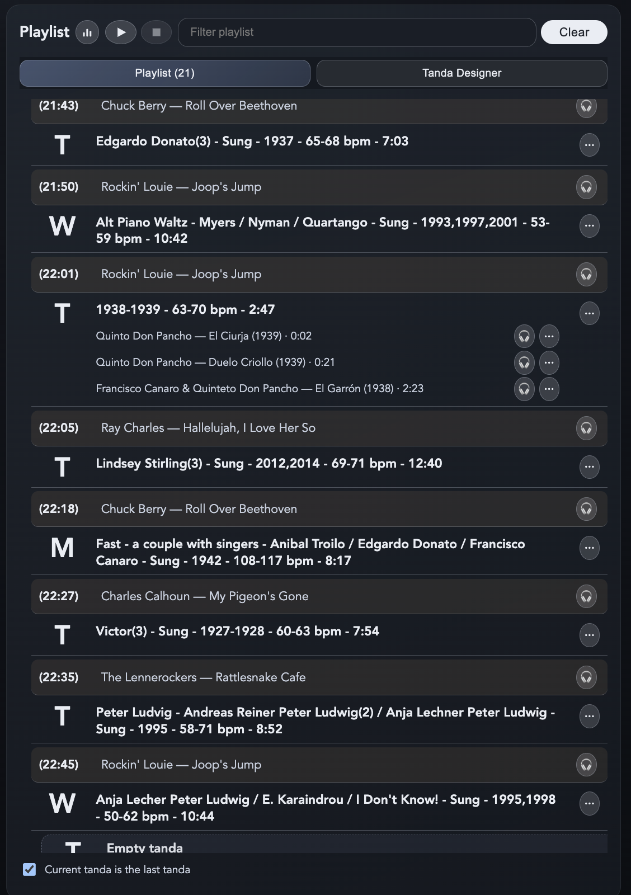

Cortinas are optional and if used, the DJ can set up sets of tracks such as Salsa, Swing, Blues or whatever and then choose which set to use for the playlist.
Once chosen, each new tanda is automatically allocated a track from that set.  Individual cortinas can be changed for any track from any set and the DJ can listen
on headphones to help choose.

To build tandas, the DJ can pick ready made tandas from one of the built-in collections in the clipboard or start building a tanda, either straight into the playlist or using a tanda designer tab in the right hand column.  

In the top right the DJ can click the display board button and a pop-out window will appear which shows the current playing track information and tanda information from the main output only. Headphone preview is never shown on the audience-facing display board. This can
be dragged to another window to show on a connected TV or Projector.  Background images for this can be configured using the background images folder set in the library tab.
If no images are set up then a simple set of coloured dots will come and go on the screen in the background instead.  Images work better.

In the top right there is a graph button which opens a view that shows the diversity in the collection as a whole. It shows the tanda counts for each artist and style and how many tracks are available and whether more tandas could be made from this to increase the diversity.  There are also years covered by the collection and the tempo/bpm coverage by style.  Less useful but might help understand that a wider set of years should be turned into tandas for example.  From the tables it is possible to click a search button for an artist and it will immediately open the search results with that orchestra/artist ready to start making more tandas.

### Music Styles

The system is given a number of single letter styles such as **T** or **W** or **M**.  Each one has a name such as "Tango". Then zero or more sub-styles can be added such as "Alternative", "Contemporary", "Traditional".  The system allows tandas that match any of the sub-styles or the
main style name as valid for a playlist position marked with the single letter such as "T".

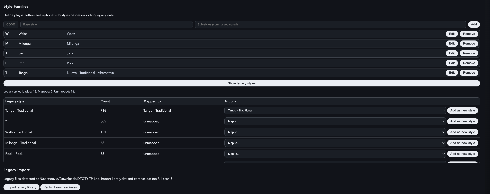

The style names are shown as search filter buttons and all matching tracks and tandas are then shown in the search results and the clipboard.

Text search is token-aware: all meaningful words you type contribute to the relevance score across title, artist, singer, DJ notes, album, style/genre, year, and BPM. DJ notes are treated as important search text because they are intentionally written for recall; imported album and album-artist metadata are searchable but rank lower. Short tokens are matched conservatively, so a search such as `Caro` targets an actual `Caro` token rather than flooding results with loosely similar words such as `Carlos`; both `de caro` and `decaro` can match `De Caro`.

The **Tanda size** control in the Search column affects tanda results only. It
lets the DJ limit the tanda search to tandas of a specific size such as `3` or
`4`. Setting it to **Any** removes that size filter, so tandas of all lengths
can appear in the search results.

Right Clicking (or press and hold) a style pill button will show the sub-styles if available allowing specific searches for "alternative" tracks and tandas.
Long-pressing a style pill (about 1 second) opens the same sub-style menu.

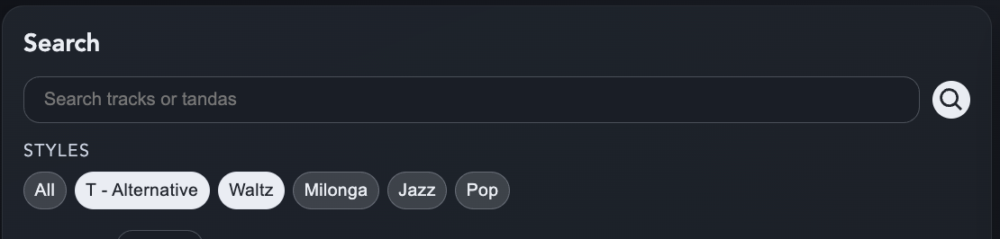

Note, that the sub-styles can be used not only for "Nuevo" or "Traditional" or "Contemporary" but could be "Stompy" and "Lyrical" and "Slow" or "Fast" or whatever might be useful.  The DJ just decides whether to use named collections to track say Lyrical tandas or whether to use styles and then use the search filters.  Whichever works for them.


### Modes

The system uses modes of operation to make the application easy to use or safe.

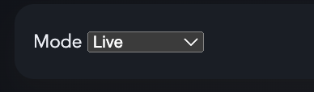

- **Live** is for DJing on the night.  The only music that will play is what's next in the playlist.
- **Preparation** is for exploring your collection whilst building tandas or playlists.  Clicking on a song plays it immediately.
- **Edit** similar to "Preparation" mode but the editor window stays open allowing the DJ to click a song and quickly adjust the data or see the album it's from etc.

### Controls

See playlist image above.

In live mode, to start the playlist, the DJ can click the small "play" button at the top or click a tanda summary in the playlist.  If the chosen tanda starts with a
cortina, and if cortinas are in use, the system will play that cortina before the tanda begins.

If the DJ clicks an individual track in **Search** or **Clipboard** while
nothing is playing in **Live** mode, Tanda Forge asks for confirmation and
then plays that track as a one-off item only.  It does **not** continue
through the playlist afterwards.  This is intended for ad-hoc performance
songs or announcements.

If the DJ clicks an individual **playlist** track while nothing is playing in
**Live** mode, playlist playback starts from that track using the normal
playlist rules.  That means the track starts immediately unless it is the
first track of a tanda with a lead-in cortina, in which case the lead-in
cortina still plays first.

In **Preparation** mode, clicking any playlist track always starts that exact
track immediately, even if another playlist track is currently playing.  It
does **not** insert the lead-in cortina first when you do this.

The stop button will cause a fade out and stop of the playlist.  Pressing play again will resume the playlist.

Whilst a cortina plays, in the now playing area the system provides two buttons; stop and play.  "Stop" will cause a fade out and then playing of the first song in the next
tanda.  "Play" will remove the auto-fade-out from the track and allow it to play in its entirity.  If having clicked "Play" the DJ wishes to then stop anyway clicking the 
"Stop" will fade out and then continue in the playlist.

Each track has a headphone icon shown next to the elipsis menu button if headphone output has been configured.  The system will try to ensure headphone output is not the live
output when setting up but some systems can present the same output under different names such as "Default" and "Main speakers" and the app has no way to spot this so it is 
still possible to set both to the same output but hopefully the DJ knows they have done this and manage the use of headphones appropriately!

The compression slider when available will mix the reduced "dynamic range" version of the song with the normal track allowing some or all of the compression to be used.  Under 
normal use the DJ should set this to 0%.

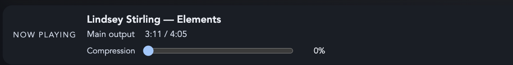

When the DJ wants the evening to finish automatically they can set the
`Remaining Tandas` number first and then enable the control when ready. The
field stays editable even while the option is off, so the display board does
not briefly announce the wrong countdown while the DJ changes the value. The
field supports `0` to `4` and defaults to `1`.
The current tanda counts as `1`, so:
- `0` means stop after the current tanda;
- `1` means stop after the next tanda;
- higher values keep counting down one tanda at a time until the stop point is reached.

If cortinas are enabled, playback still includes the final cortina after the
stop-triggering tanda. Display behavior is:
- the final-tanda countdown line appears only when more than one tanda remains;
- once the actual final tanda starts, the board shows only the final warning, not
  both a countdown and a duplicate final-tanda message;
- the audience display uses the full style or sub-style label, then a slightly
  larger normalized artist line, and then an optional `Singer:` line when singer
  metadata exists;
- the progress line shows `Playing N/M`.
- lead-in cortinas before counted-down tandas stay normal ("Cortina" + "This tanda: {style}" with the artist on the next line);
- while tracks in the counted-down tandas are playing, the bottom-right area adds
  a localized countdown line such as "Last two tandas";
- while tracks in the actual final tanda are playing, that countdown line sits
  above the localized "This is the last tanda" message;
- the final cortina after that tanda shows only "That's all folks";
- after that final cortina ends and playback stops, the display remains on "That's all folks" until new playback/display state replaces it.

During normal playback, the bottom-right `Next tanda` line now includes the
next tanda style and artist summary, for example `Next tanda: Tango from Di
Sarli`. If the upcoming tanda has more than one distinct normalized artist, the
artist part becomes the localized equivalent of `Various artists`. The display
uses a smaller size and wider right-aligned line there so it is less likely to wrap.

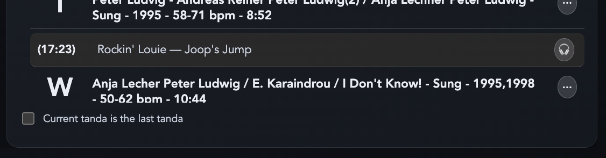

For live performances, there is a second playlist checkbox: "Stop after this tanda for a live performance".  This behaves differently from the "last tanda" option:
- the tanda plays normally;
- the following cortina plays normally;
- during that tanda and cortina, the display board shows no bottom-right tanda text;
- after the cortina finishes, the playlist pauses instead of ending;
- the DJ can then click confirmed one-off tracks from Search or Clipboard for the performance itself;
- when the DJ later presses Playlist **Play**, Tanda Forge replays that same cortina and then continues into the next tanda/item in the playlist.

That checkbox can be turned on before the tanda starts or while that tanda is
already playing. If it is enabled during the tanda, the stop still applies
after that tanda's following cortina.

Tip: create a named clipboard collection such as `Show`, `Performance`, or the
name of the act, and put the required performance tracks into it ahead of time.
Then, when the moment comes, the DJ can switch straight to that collection and
the required one-off tracks are immediately available.

### Menus

The application uses single-letter menus on tracks and tandas to make a safe way to work instead of dragging and possibly accidentally dropping causing live playback!

The general options are:
- **S**: Search for similar - fills the search column's search field with the artist, year, tempo, notes etc. from the current track or tanda and starts the search.
the Search results are scored and ranked.  However, the search results can be quickly navigated using the "Jump to" letters.  By default the letters apply to the title
but the DJ can choose the artist or year columns instead.
- **C**: Send to clipboard - sends the song to either the "General" collection if a built-in collection is in focus or to the currently open user collection.
- **P**: Send to playlist - tandas are sent to the marked target in the playlist or to the end of the playlist if no target.  Style mis-mmatch or size mis-match warnings are given 
but nothing is blocked.  Sending a track to the playlist will either create a new empty tanda and add the track as the first entry or append the current tanda until that
tanda has the playlist's preferred track count in which case it will start another tanda.  So the playlist can be built track by track if required or a mix of tandas and tracks.
- **T**: Send to the tanda designer - as for sending to the playlist except the target is in the tanda designer and has nothing to do with the playlist's contents.
- **E**: Edit - used for tracks this pops up a window showing all track data.  Next to each value is a "S" button for searching and each button sends the current fields text to the search
field in the search column.  Clicking more "S" buttons adds more text allowing the tempo and year and artist to be used for searching for example.
- **R**: Remove - removes the track or tanda from the named collection or playlist.  Removal of a tanda from a playlist causes an empty placeholder to be added to maintain the playlist sequence.
- **M**: Context action:
  - In playlist tandas/tracks: mark as target for replace/swap flows.
  - In clipboard tandas/tracks: move (or copy, from smart collections) to another collection.
- **X**: Swap - send the current tanda to the current target and bring that target's tanda to the current position.  Style and size warnings may be given but nothing is blocked.

In addition, the menu buttons - circles with the elipsis in it ("...") - can be coloured white which indicates either a full or partial overlap with the current playlist.  Clicking the button 
opens the menu as normal but also causes the playlist to scroll to the first instance of the track or tanda that overlaps.

Within Playlists:

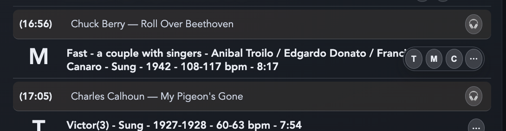

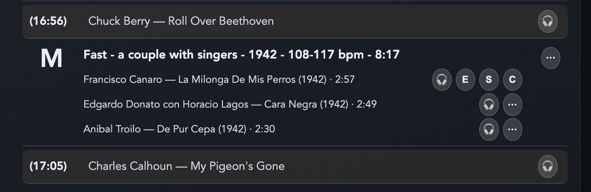

Within Collections:

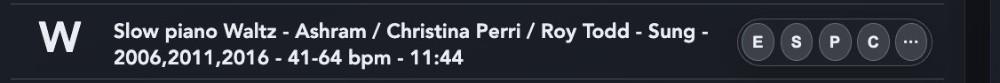


### Collections

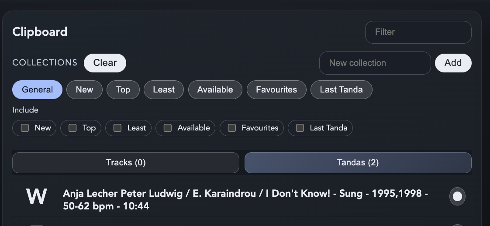

All collections can hold tracks and tandas.  The DJ can add any named collection in addition to the built-in ones and can view any combination of them at the same time. 
The music style such as Tango or Vals can be controlled through the "Search" column's style options and can be set to "Any" or any combination of styles.  The DJ can add
more styles into the configuration page and then classify songs or tandas using the new styles for use later.

The built-in collections are:

- **General**: A general purpose dumping ground for possible playlist tandas or tracks and where cleared out tandas from the playlist are sent.
- **New**: A collection of the last 100 tandas saved (edited or created) and the last 100 tracks added to the system
- **Top**: Each time a tanda or track is played all the way through it is counted and this collection shows the ones with the highest counts - i.e. your most commonly played
- **Lowest**: As for "Top" but of the lowest counts, i.e. the ones you seldom play - perhaps help the DJ to re-discover forgotten classics.
- **Available**: Working with the graph of the playlist's diversity, this collection contains tracks and tandas that are by artists and styles not yet included in the playlist.  I.e. if 
some "Di Sarli" Tango tandas are in the playlist, there will be no "Di Sarli" Tango tandas shown in the available list but his Waltzes and Milongas might be.  This helps offer quick options
that will increase the artist diversity within the playlist.

All are dynamic meaning they change their contents as the DJ works.

Ideas for named collections might be some tandas that you like to play at the end of an event, or crowd-pleasers etc.

All collections can be filtered by both the "search" style and any text such as song titles or artist names using the "filter" in the collections column.

All non built-in collections including **General** can be cleard with a single click of the **Clear** button.

Tandas and tracks can be moved from one collection to another and to General by default using the **M** menu option and if there are multiple possible targets, it will offer a picklist otherwise if there is only one writable (i.e. not build-in rule based collection) then it will not prompt and will just move.

### Export and Backup

There are three different import/export areas in the app and they serve different purposes:

- **Playlist Files** in **Settings > Playlist**
- **Export Tandas** in **Settings > Library**
- **System Export / Import** in **Settings > Library**

They are deliberately separate because they back up different levels of information.

#### 1) Playlist Files

Use this when you want to save or move the current playlist only.

- save as JSON for the highest-fidelity Tanda Forge playlist backup
- save as grouped M3U/M3U8 for broader interoperability
- import either format back into the current playlist

This does **not** back up your whole library database, saved tandas collection, waveform cache, compressed cache, or all app settings.

#### 2) Export Tandas

Use this when you want to preserve your curated saved tandas without exporting the whole application.

What **Export Tandas** includes:

- saved tanda definitions
- tanda names
- tanda styles
- tanda ratings
- tanda track membership
- portable track references for matching on another machine

What it does **not** include:

- the audio files themselves
- playlist state
- waveform images
- compressed playback files
- application settings
- logs

This is useful when:

- you have built up good tandas and want to archive them
- you want to move tanda curation separately from the rest of the app state
- you want a smaller export than a full system backup

#### 3) System Export / Import

Use this when you want a complete backup or a machine-to-machine restoration of the app state.

What **System Export** includes:

- database records
- saved tandas
- playlist persistence state
- waveform cache
- compressed cache
- logs
- persisted application settings
- only Tanda Forge-managed data files; Electron runtime cache folders such as `DawnCache` are excluded and recreated automatically

What it does **not** include:

- the external music files in your configured music folder
- the external cortina files in your configured cortina folder
- the external display-image files in your configured background-image folder

This is the right option when:

- you are backing up the working state of the application
- you are moving to another laptop and want the same database and caches
- you want the easiest restore path after corruption or accidental reset

#### Practical Recommendation

Choose the export/import path based on what you are trying to preserve:

- **Current playlist only**: use **Playlist Files**
- **Saved tandas only**: use **Export Tandas**
- **Everything about the app state**: use **System Export / Import**

If in doubt, use **System Export** for backup and **JSON playlist export** for sharing or transferring a currently prepared playlist.

### Working With Tandas

There are several ways a tanda can be created or filled:

- **Use an existing tanda from Search**: click **P** to send it to the playlist, **C** to send it to the active clipboard collection, or **T** to open it in the Tanda Designer for editing first.
- **Use an existing tanda from a clipboard collection**: click **P** to place it in the playlist, or **T** to open it in the Tanda Designer.
- **Build a tanda from individual tracks**:
  - from **Search**, use **P** on a track to add it into the playlist. The app will create or continue a tanda there as needed.
  - from **Search**, use **T** on a track to send it into the Tanda Designer.
  - from a **clipboard track**, use **P** to add it into the playlist or **T** to send it into the Tanda Designer.
  - from a **playlist tanda**, use the per-track send actions to move a track out to the clipboard or into another tanda slot.
- **Auto-fill can create tandas automatically** when rebuilding a playlist and no saved tanda fits the required slot.

Once a tanda is open in the **Tanda Designer** or the playlist-hosted tanda editor, it can be changed in several ways:

- click tracks to audition them in Preparation or Edit mode
- use the per-track menu to remove a track from the tanda
- use the track move buttons in the editor to re-order tracks inside the tanda
- send more tracks into the open tanda from Search or Clipboard
- change the tanda name and other tanda-level details
- click **Save** to keep the tanda

Deleting or removing a tanda depends on where you are looking at it:

- **Delete a saved tanda itself**: open it in the Tanda Designer with **T**, then click **Delete**. This removes the tanda record, so it disappears from collections and can no longer be used in playlists.
- **Remove a tanda from a clipboard collection only**: use **R** on the tanda in that collection. This removes it from that collection view, but does not delete the tanda from the library if it still exists elsewhere.
- **Remove a tanda from the playlist**: use **R** on the playlist tanda. The playlist keeps its sequence shape by leaving an empty placeholder slot.
- **Delete a tanda seen in a collection**: as a safe rule, use **T** to send it to the Tanda Designer and then use **Delete** there.

Re-ordering can happen in more than one place:

- **Inside a tanda**: use the move controls in the Tanda Designer or playlist-hosted tanda editor.
- **Between playlist positions**: use the playlist tanda move/swap controls to reposition tandas in the running order.
- **Between clipboard collections**: use **M** to move a tanda from one collection to another.

### Now Playing

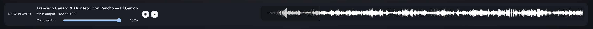

The bar across the top of the app shows the song now playing.  As well as the artist and title etc. it also shows the "waveform" of the song's loudness over time.  In modes other than 
"Live" clicking somewhere on that waveform will skip the playback to that position either forwards or backwards.  This is useful to quickly assess if there is singing in a song when 
classifying or simply to hear how a track ends.

Below the now playing text is a compression control.  "Compression" in this context is a dynamic-range compression in which the quieter parts of the track are made louder - almost as loud
as the loudest parts of the song.  This removes the dynamic effects the orchestra intended but is useful when there is a lot of chatter on the dance floor, perhaps at the start of a new
tanda or song as it makes the details otherwise lost stand out.  The DJ does not need to turn up the amplifier or mixer's volume control which might make the louder parts too loud and painful to hear.  This in turn allows those who wish to dance to hear the music's beat or details well enough to start dancing.  Once the chatter dies down
the DJ can return the dynamic range by reducing the compression level back to zero.

## Playlist

A playlist can be built up as required and then cleared using the **Clear** button.  This button will offer to just clear or to clear and re-fill.

### Clear and Auto-Fill

- Click **Clear** in the playlist header to open playlist clear options.
- Choose **Clear playlist** to empty the list without changing configuration.
- Choose **Clear and auto-fill** to rebuild the playlist from your saved tandas
  and sequence rules until projected playback reaches the configured end time.
- If no suitable tanda is available for a slot, the app builds an ad-hoc tanda
  from similar tracks (same style first, then progressively relaxed matching).
- Auto-fill never reuses a track title already present in the generated playlist.

If the tanda sequence configured uses a grouped option such as "3t 3t 3w 3t 3t (3m 3c 3f)" (where 'c' might be Candombe and 'f' might be Foxtrot) then a tanda matching any of those styles will be picked or built if required.

## Track Meta data

Any track data can be modified by using the **E** menu option which opens the editor or alternatively if doing many, set the mode to **Editor** which will keep the editor window open allowing single clicks on tracks to load the data for editing.

Each field can be modified and can also be used to add to a search for similar items using the **S** button next to each field - the current field value is appended to the search

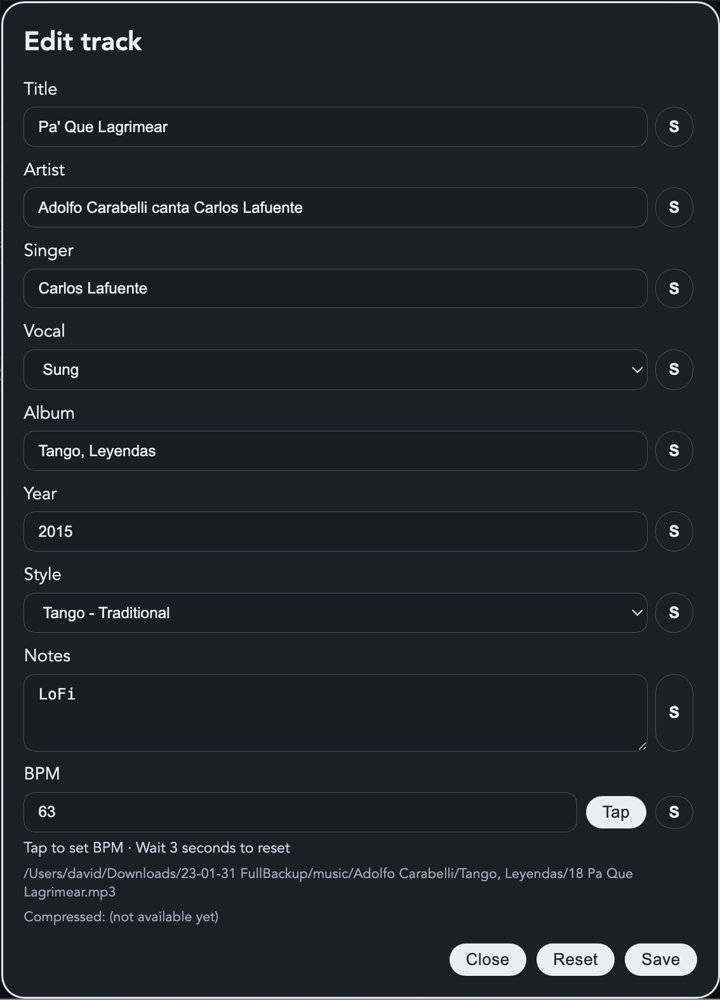

## Initial Setup

### 1) Choose Library Root Folders

You need at least one music folder, and optionally a cortina folder.

1. Open **Settings** (gear icon).
2. In **System**, click **Add Music Folder** and choose a folder.
3. (Optional) Click **Add Cortina Folder** and choose a folder.
4. If migrating from an older Tanda Player system, use **Legacy Import** first.
5. Then run **Startup Flow** to scan music/cortinas and build waveform and compressed caches.

### 2) Importing Legacy Data

If you are migrating from the previous system:

1. Open **Settings > Library**.
2. Use **Legacy Import**.
3. This imports legacy tandas and metadata into the database.
4. Then run **Startup Flow** to scan the files properly and build the derived assets.

This is intentionally separate from the resumable startup flow because legacy import replaces tanda data rather than simply repairing caches.

### 3) Restoring From a Full Backup

If you have a previous **System Export**:

1. Open **Settings > Library**.
2. Click **Import System**.
3. Confirm the replacement.
4. Restart or continue using the restored system state.

This restores the full application data root, not just a playlist or tanda file.

### 4) Rebuilding After Database Loss

If the database has been erased or corrupted and you do **not** have a full system backup:

1. Re-add the music and cortina roots if needed.
2. If you have old-system data, run **Legacy Import** first.
3. Run **Startup Flow**.
4. Wait for music scan, cortina scan, waveform generation, and compressed cache preparation to finish.

### 5) Importing a Playlist Onto Another Laptop

For a second laptop with access to the same music library layout:

1. Export the playlist from the first laptop:
   - use JSON for the most faithful Tanda Forge transfer
   - use grouped M3U/M3U8 for broader compatibility
2. Copy the playlist file to the second laptop.
3. Ensure the second laptop has the same music collection available through configured music roots.
4. Open **Settings > Playlist** on the second laptop.
5. Use **Import Playlist**.
6. Review any warnings about missing or ambiguous files.

If your goal is to move the whole application state rather than just the playlist, use **System Export / Import** instead.


### 2) Select Audio Outputs

1. In **System**, choose **Main Output** and **Headphones Output**.
2. Headphone output enables previewing tracks without sending them to the main speakers.

### 3) Set Language

1. In **System**, choose **Language**.
2. UI labels, menu shortcuts, and tooltips update based on the selected language.

### 4) Playlist Timing

In **Settings -> Playlist**, the gap/timing controls work as follows:

1. **Gap between tracks** controls transitions inside a tanda.
2. **Gap before tanda** controls the handover from a cortina or prior item into the first track of the next tanda.
3. **Gap before cortina** controls the handover from the last track of a tanda into the cortina.

For all three controls:

- Positive values add silence.
- `0` means no added silence.
- Negative values create overlap/crossfade between the outgoing and incoming items.

### 4) Adjust Trim Padding (Optional)

1. In **System**, set **Trim padding (sec)** to extend auto-detected track trims.
2. Use this if song tails feel too short i.e. gets cut-off at the start or end.

### 5) Configure Playlist Defaults (Optional)

1. In **Playlist**, set your default tanda size and start time.
2. Choose a **Cortina Set** and **Duration** if you use cortinas.

### 6) Manage Styles (Optional)

Use **Styles** in **Settings -> Library** to add or remove style labels used for filtering and sequence rules.

- You can define aliases in the style input using `;` or `/`.
- Example: `Waltz;Vals;Valse`.
- The first value (`Waltz`) is the canonical style pill.
- Other values are aliases used to map imported/scanned genres back to the canonical style.
- Click an existing style row to load it into the input for editing.

## Importing legacy data

If key files from an old Tanda Player are available in the location the user identifies as the music and cortina source, the system will provide a button to allow importing the legacy data so that the DJ does not have to re-create all their tandas and fix up track data.

Before importing the user should set up the mapping of the legacy style names to the style names the new app should use for all filtering and playlist construction.  This is done in the settings page under system.  Once done, go back to the library tab and import the legacy data.

In **Library -> Style Families**, click **Show legacy styles** to view distinct classifier-derived styles from `library.dat` (`classifiers.style` plus optional `classifiers.sub-style`), how often they appear, and whether they currently map to an existing canonical style. Values with no classifier style are shown as `?`.
For each legacy style row:

- choose an existing canonical style in the dropdown to map this legacy value as an alias, or
- fill **Code / Base style / Alias** and click **Add as new style** to create and map that legacy value immediately.
- mappings are remembered per legacy root and automatically reused on future imports.

When importing legacy tandas, legacy names equal to `Auto Generated Tanda` or `Saved Auto-Generated Tanda` are intentionally cleared so the app can show its richer dynamic artist-summary label instead (including simple quote/dash/spacing variants of those labels).

Although the old legacy data does include some information to help normalise the sound levels and trim tracks, the compression and trimming is slightly different and so it is recommended to use the **scan** buttons and leave the system to read the files.

In **Settings -> Library**, the buttons are grouped by purpose:

- **Startup Flow** runs the recommended end-to-end setup in one action.
  - It scans music and cortinas, generates missing waveform PNGs, and precomputes compressed companion files.
  - The phase line ends with a ticked **Done** step when the workflow finishes successfully.
  - It is safe to run again after a shutdown or interruption; finished scans and cache work are reused where possible.
  - The one-stop setup card now mirrors scan and compression progress directly in that area and shows a rough time-remaining estimate for the current step once enough progress has been observed.
  - This is the recommended path after adding roots for the first time or after using **Erase Database**.
- **Legacy Import** is now a separate one-time migration step.
  - Use it only if you are bringing tandas and metadata across from the old system.
  - It is separate from **Startup Flow** because it replaces existing tanda data rather than behaving like a resumable rebuild step.
- **Library Scan** refreshes the database, analysis, and waveform PNG cache from the music and cortina folders.
- Re-running **Scan Music** or **Scan Cortinas** imports newly discovered files, removes tracks whose files have disappeared, and skips overwriting stored editable metadata for already known tracks.
- If you intentionally want to rebuild track text fields from stored tags after parser changes, use **Re-parse Stored Metadata** instead of a normal scan.
- **Re-parse Stored Metadata** rebuilds title, artist, artist summary, and singer from already stored tag data.
  - Use this after parser changes or metadata cleanup when you want to refresh credits without rerunning ffmpeg analysis, waveform PNG generation, or compressed-cache work.
- **Derived Caches** manages the expensive on-disk cache files.
- **Library Maintenance** contains database-only cleanup.
- **System Export / Import** backs up or restores the complete application data folder (database, caches, logs, and persisted settings).

The legacy migration card is shown separately from the resumable startup flow, and the remaining scan/cache/maintenance/backup tools sit inside one shared manual-tools area so their optional/manual role is clear.

If **compression** (dynamic range reduction) is enabled, the system can generate compressed files on demand when a track starts, but this may cause a short delay or CPU spike. Clicking **Precompute compressed cache** renders those compressed companions in advance. This takes a long time, but it is optional and only needed if compression will be used.

If you want to keep the cache files on disk but do not fully trust them, use **Verify cached files**. This checks waveform PNGs and compressed cache files, removes broken or incomplete entries, and leaves valid cached files in place. Use **Erase Cached Files** only if you want to remove those derived files entirely and force them to be rebuilt later.

**Erase Database** now removes only the database records. It does not remove waveform or compressed cache files. After using it, run **Startup Flow** to rebuild a complete working library from the configured roots.

For one-off metadata cleanup outside the app, there is also a standalone repair utility:

```bash
node scripts/repair-instrumental-markers.js --db /path/to/tanda-player.db --dry-run
node scripts/repair-instrumental-markers.js --db /path/to/tanda-player.db
```

This scans the `tracks` table for title or artist values with a trailing `instrumental` marker, strips that marker cleanly even when it is written with dotted separators or followed by trailing qualifiers such as remaster/short tags, clears `Singer`, and forces the track's instrumental flag on.

In **Settings -> Diagnostics**, the app shows the actual `ffmpeg` and `ffprobe` paths it is using and whether each one came from the bundled app resources, a custom tools folder, or the system `PATH`.

- Normal behavior is to use the bundled binaries shipped with the app.
- If that is not possible on a particular machine, use **Choose FFmpeg tools folder** and select a folder containing `ffmpeg` and `ffprobe` (or `ffmpeg.exe` and `ffprobe.exe` on Windows).
- Resolution order is: bundled binaries, custom tools folder, then system `PATH`.
- You do not need to patch files directly into the installed app folder.

## Tips and Good Practices

- Use the clipboard as your “sandbox” for experimenting with tandas.
- Use styles to keep a consistent flow (e.g., Tango → Vals → Milonga).
- Preview cortinas with headphones so you don’t interrupt the room.
- Use the playlist start time to plan your evening and estimate timing.
- Set a playlist **expected end time** (Settings → Playlist) so auto-fill knows
  when to stop, including sessions that end after midnight.

## Compression Slider Behavior

If **Enable live compression control** is checked in Settings -> System, the
now-playing panel shows a **Compression** slider.

- The slider is for the current item only. Each new song or cortina starts with
  the mix back at `0%`.
- If playback starts before the compressed companion file is ready, the slider
  is temporarily disabled and displayed as `0%`.
- When the compressed companion becomes available, the slider is enabled again
  and can then be raised deliberately by the DJ.
- About 20 seconds before the effective end of the item, the app automatically
  returns the mix to `0%` so fade-outs are not corrected upward.
- If compression is disabled in Settings, no compressed companion files are built.

## Diagnostics (If Something Seems Off)

Check **Settings → Diagnostics** for:

- Audio tool locations (ffmpeg/ffprobe)
- Waveform paths and test button
